# 📡 Algorithm_Design_And_Monte_CarloAnalysis

### 0. 개요

- 목표: **6-DOF(Degree of Freedom)** 기반의 **유도조종 알고리즘 설계 및 몬테카를로 성능 분석**

- 기대효과: ① 실제 산업 현장에서 유도무기 성능 분석에 필요한 도메인 지식 획득 ② 실산업에 적용 가능한 인사이트 획득

### 1. 설계구조 및 실험환경

- 설계구조(베이스라인)
```
src/
│
├── main.py
│   └─ 시뮬레이션 실행 진입점(객체 생성, 시뮬레이션 실행, miss distance 계산, 결과 출력 및 시각화)
│
├── config.py
│   └─ 시뮬레이션 전역 설정값(dt, 총 시간, 항법 이득 등) 관리
│
├── simulation.py
│   └─ 시뮬레이션 엔진(시간 루프, 유도→제어→동역학 업데이트 흐름 제어, 히스토리 저장)
│
├── models/
│   ├── __init__.py
│   │   └─ 패키지 초기화 파일(모듈 import 경로 구성)
│   │
│   ├── base.py
│   │   └─ 동역학 모델 공통 인터페이스 정의(step 메서드 강제)
│   │
│   ├── missile.py
│   │   └─ 미사일 2D 동역학 모델(위치·속도·가속도 명령 상태 및 시간 적분)
│   │
│   └── target.py
│       └─ 표적 2D 동역학 모델(위치·속도 상태 및 시간 적분)
│
├── guidance/
│   ├── __init__.py
│   │   └─ 패키지 초기화 파일
│   │
│   ├── base.py
│   │   └─ 유도법칙 공통 인터페이스 정의(compute_command 강제)
│   │
│   └── png.py
│       └─ Proportional Navigation 구현(LOS rate 기반 가속도 명령 계산)
│
├── control/
│   ├── __init__.py
│   │   └─ 패키지 초기화 파일
│   │
│   ├── base.py
│   │   └─ 제어기 공통 인터페이스 정의(update 강제)
│   │
│   └── ideal_controller.py
│       └─ 이상적 가속도 응답 모델(명령 가속도를 즉시 적용)
│
└── analysis/
    ├── __init__.py
    │   └─ 패키지 초기화 파일
    │
    └── metrics.py
        └─ 성능 분석 함수(miss distance 계산 등 평가 지표 정의)

```

| Param | Unit |
| --- | --- |
| **위치(pos)** | m |
| **거리(vel)** | m/s |
| **가속도(acc)** | m/s<sup>2</sup> |
| **시간(t/dt)** | s |
| **LOS Rate** | rad/s |

- 실험환경: MacBook Pro
 
 | About | Specification |
 | --- | --- |
 | **OS** | 13.7.8 |
 | **Processor** | 2.3GHz Dual-Core Intel Core i5 |
 | **Graphic** | Intel Iris+ Graphics 640 1536MB |
 | **Memory** | 8GB 2133MHz LPDDR3 |

### 2. 실험 내용

#### [Exp01]: Baseline

- 목표: Baseline의 성능 확인
- 이유: 추후 연구 필요성 확인
- 일시: 2026.03.05

| Param | PNG(Base) |
| --- | --- |
| **Dt** | 0.01 |
| **TotalTime** | 20.0 |
| **NavigationGain** | 3.0 |
| **Vel(Missile(X),Target(X))**| (300, 250) | [(300, 250) | (300, 250) | (300, 250) | (300, 250) | (300, 250) |
| **MissDistance** | 4121.55 |

#### [Exp02]: NavigationGain(N)

- 목표: NavigationGain(N) 변화에 따른 유도 성능 확인
- 이유: Miss Distance를 최소화하기 위해 NavigationGain 변수 조정可
- 일시: 2026.03.05

| Param | PNG(Base) | PNG(Tune_1) | PNG(Tune_2) | PNG(Tune_3) | PNG(Tune_4) | PNG(Tune_5) |
| --- | --- | --- | --- | --- | --- | --- |
| **Dt** | 0.01 | 0.01 | 0.01 | 0.01 | 0.01 | 0.01 |
| **TotalTime** | 20.0 | 20.0 | 20.0 | 20.0 | 20.0 | 20.0 |
| **NavigationGain** | 3.0 | 1.0 | 2.0 | 4.0 | 5.0 | 6.0 |
| **Vel(Missile(X),Target(X))**| (300, 250) | [(300, 250) | (300, 250) | (300, 250) | (300, 250) | (300, 250) |
| **MissDistance** | 4121.55 | 4122.48(⇡) | 4121.97(⇡) | **4121.21(⇣)** | **4120.92(⇣)** | **4120.68(⇣)** |

- 결과 해석: 미사일과 표적이 거의 같은 방향으로 비행할 때 초기 각속도(λ)가 0에 수렴 ⇢ PN 가속도 0에 수렴 ⇢ 미사일은 단순 추적 상태 ⇢ 요격不可

#### [Exp03]: 초기 기하 조건

- 목표: 초기 기하 조건 변경에 따른 유도 성능 확인
- 이유: 표적 진행방향의 측면에서 미사일이 발사되어야 LOS Rate 발생可(서로 나란한 경우 LOS Rate가 0에 수렴함)
- 일시: 2026.03.05

| Param | PNG(Base) | PNG(Tune_1) | PNG(Tune_2) | PNG(Tune_3) | PNG(Tune_4) | PNG(Tune_5) |
| --- | --- | --- | --- | --- | --- | --- |
| **Dt** | 0.01 | 0.01 | 0.01 | 0.01 | 0.01 | 0.01 |
| **TotalTime** | 20.0 | 20.0 | 20.0 | 20.0 | 20.0 | 20.0 |
| **NavigationGain** | 3.0 | 1.0 | 2.0 | 4.0 | 5.0 | 6.0 |
| **Vel(Missile(X),Target(Y))**| (300, -200) | (300, -200) | (300, -200) | (300, -200) | (300, -200) | (300, -200) |
| **MissDistance** | 0.00 | 0.39(⇡) | 1.46(⇡) | 0.13(⇡) | 0.52(⇡) | 1.64(⇡) |

- 결과 해석: ① N(3 or 4): 안정적 요격可 ② N(1 or 2): 대부분 요격 실패 ③ N(5 or 6): 과도한 가속도가 요구되어 궤적이 급격히 휘어짐(실제 상황에서 불안정함)

#### [Exp04]: 적분 함수 변경

- 목표: 적분 함수 변경에 따른 유도 성능 확인
- 이유: RK4 적분은 Euler 적분에 비해 **dt 변화**에 덜 민감하고 **궤적 왜곡률**이 낮아 높은 **실무 적합성**을 보일 것으로 기대됨
- 일시: 2026.03.05


| Param | PNG(Base) | PNG(Tune_1) | PNG(Tune_2) | PNG(Tune_3) | PNG(Tune_4) | PNG(Tune_5) | PNG(Tune_6) | PNG(Tune_7) | PNG(Tune_8) | PNG(Tune_9) |
| --- | --- | --- | --- | --- | --- | --- | --- | --- | --- | --- |
| **Dt** | 0.01 | 0.02 | 0.03 | 0.04 | 0.05 | 0.06 | 0.07 | 0.08 | 0.09 | 0.1 |
| **TotalTime** | 20.0 | 20.0 | 20.0 | 20.0 | 20.0 | 20.0 | 20.0 | 20.0 | 20.0 | 20.0 |
| **NavigationGain** | 3.0 | 3.0 | 3.0 | 3.0 | 3.0 | 3.0 | 3.0 | 3.0 | 3.0 | 3.0 |
| **Vel(Missile(X),Target(Y))**| (300, -200) | (300, -200) | (300, -200) | (300, -200) | (300, -200) | (300, -200) | (300, -200) | (300, -200) | (300, -200) | (300, -200) |
| **적분 함수** | Euler | Euler | Euler | Euler | Euler | Euler | Euler | Euler | Euler | Euler |
| **MissDistance** | 0.68 | **0.04(0.64⇣)** | **0.59(0.09⇣)** | 1.22(0.54⇡) | 5.04(4.36⇡) | 2.48(1.80⇡) | 3.28(2.60⇡) | 3.73(3.05⇡) | 4.35(3.67⇡) | 7.81(7.13⇡) |

- 결과 해석: Euler 성능 민감도(평균 상대오차값)가 **0.67**로 낮은 수치 신뢰성을 가짐을 확인可


| Param | PNG(Base) | PNG(Tune_1) | PNG(Tune_2) | PNG(Tune_3) | PNG(Tune_4) | PNG(Tune_5) | PNG(Tune_6) | PNG(Tune_7) | PNG(Tune_8) | PNG(Tune_9) |
| --- | --- | --- | --- | --- | --- | --- | --- | --- | --- | --- |
| **Dt** | 0.01 | 0.02 | 0.03 | 0.04 | 0.05 | 0.06 | 0.07 | 0.08 | 0.09 | 0.1 |
| **TotalTime** | 20.0 | 20.0 | 20.0 | 20.0 | 20.0 | 20.0 | 20.0 | 20.0 | 20.0 | 20.0 |
| **NavigationGain** | 3.0 | 3.0 | 3.0 | 3.0 | 3.0 | 3.0 | 3.0 | 3.0 | 3.0 | 3.0 |
| **Vel(Missile(X),Target(Y))**| (300, -200) | (300, -200) | (300, -200) | (300, -200) | (300, -200) | (300, -200) | (300, -200) | (300, -200) | (300, -200) | (300, -200) |
| **적분 함수** | RK4 | RK4 | RK4 | RK4 | RK4 | RK4 | RK4 | RK4 | RK4 | RK4 |
| **MissDistance** | 0.99 | **0.67(0.32⇣)** | **0.35(0.64⇣)** | **0.03(0.96⇣)** | 3.49(2.50⇡) | **0.62(0.37⇣)** | 5.45(4.46⇡) | 1.26(0.27⇡) | 1.58(0.59⇡) | 10.87(9.88⇡) |

- 결과 해석: RX4 성능 민감도(평균 상대오차값)가 **4.21**로 Euler 대비 수치 신뢰성이 하락함을 확인可 ⇢ 연속 최소거리 계산 방식으로 Metric 변경要(현재 설정에서 측정방식이 너무 거침)


| Param | PNG(Base) | PNG(Tune_1) | PNG(Tune_2) |
| --- | --- | --- | --- |
| **Dt** | 0.02 | 0.01 | 0.005 |
| **TotalTime** | 20.0 | 20.0 | 20.0 |
| **NavigationGain** | 3.0 | 3.0 | 3.0 |
| **Vel(Missile(X),Target(Y))**| (300, -200) | (300, -200) | (300, -200) | (300, -200) |
| **적분 함수** | Euler | Euler | Euler |
| **MissDistance** | 0.00 | 0.00 | 0.00 |


| Param | PNG(Base) | PNG(Tune_1) | PNG(Tune_2) |
| --- | --- | --- | --- |
| **Dt** | 0.02 | 0.01 | 0.005 |
| **TotalTime** | 20.0 | 20.0 | 20.0 |
| **NavigationGain** | 3.0 | 3.0 | 3.0 |
| **Vel(Missile(X),Target(Y))**| (300, -200) | (300, -200) | (300, -200) | (300, -200) |
| **적분 함수** | RK4 | RK4 | RK4 |
| **MissDistance** | 0.00 | 0.00 | 0.00 |

- 결과 해석: (Metric 변경 후) 연속 최소거리 계산 방식 변경을 통해 수치 신뢰성이 상승함을 확인可


| Param | PNG(Base) | PNG(Tune_1) | PNG(Tune_2) | PNG(Tune_3) | PNG(Tune_4) | PNG(Tune_5) |
| --- | --- | --- | --- | --- | --- | --- |
| **Dt** | 0.01 | 0.01 | 0.01 | 0.01 | 0.01 | 0.01 |
| **TotalTime** | 20.0 | 20.0 | 20.0 | 20.0 | 20.0 | 20.0 |
| **NavigationGain** | 1.0 | 2.0 | 3.0 | 4.0 | 5.0 | 6.0 |
| **Vel(Missile(X),Target(Y))**| (300, -200) | (300, -200) | (300, -200) | (300, -200) | (300, -200) | (300, -200) |
| **적분 함수** | Euler | Euler | Euler | Euler | Euler | Euler |
| **MissDistance** | 0.32 | **0.00(⇣)** | **0.00(⇣)** | **0.00(⇣)** | **0.00(⇣)** | **0.00(⇣)** |


| Param | PNG(Base) | PNG(Tune_1) | PNG(Tune_2) | PNG(Tune_3) | PNG(Tune_4) | PNG(Tune_5) |
| --- | --- | --- | --- | --- | --- | --- |
| **Dt** | 0.01 | 0.01 | 0.01 | 0.01 | 0.01 | 0.01 |
| **TotalTime** | 20.0 | 20.0 | 20.0 | 20.0 | 20.0 | 20.0 |
| **NavigationGain** | 1.0 | 2.0 | 3.0 | 4.0 | 5.0 | 6.0 |
| **Vel(Missile(X),Target(Y))**| (300, -200) | (300, -200) | (300, -200) | (300, -200) | (300, -200) | (300, -200) |
| **적분 함수** | RK4 | RK4 | RK4 | RK4 | RK4 | RK4 |
| **MissDistance** | 0.58 | **0.00(⇣)** | **0.00(⇣)** | **0.00(⇣)** | **0.00(⇣)** | **0.00(⇣)** |

- 결과 해석: N(>1)에서 안정적 요격可

#### [Exp05]: 이상적 3D PN으로의 확장

- 목표: 2D(x,y)에서 3D(x,y,z)로의 확장
- 이유: 실제 유도 환경과 유사한 환경을 구축하기 위함
- 일시: 2026.03.05


| Param | PNG(Base) | PNG(Tune_1) | PNG(Tune_2) |
| --- | --- | --- | --- |
| **Dt** | 0.02 | 0.01 | 0.005 |
| **TotalTime** | 20.0 | 20.0 | 20.0 |
| **NavigationGain** | 3.0 | 3.0 | 3.0 |
| **Vel(Missile(X),Target(Y))**| (300, -200) | (300, -200) | (300, -200) | (300, -200) |
| **적분 함수** | RK4 | RK4 | RK4 |
| **MissDistance** | 0.00 | 0.00 | 0.00 |

- 결과 해석: Dt(0.005)에서 곡선이 아닌 직선적인 방향 전환이 관측됨


| Param | PNG(Base) | PNG(Tune_1) | PNG(Tune_2) | PNG(Tune_3) | PNG(Tune_4) | PNG(Tune_5) |
| --- | --- | --- | --- | --- | --- | --- |
| **Dt** | 0.01 | 0.01 | 0.01 | 0.01 | 0.01 | 0.01 |
| **TotalTime** | 20.0 | 20.0 | 20.0 | 20.0 | 20.0 | 20.0 |
| **NavigationGain** | 1.0 | 2.0 | 3.0 | 4.0 | 5.0 | 6.0 |
| **Vel(Missile(X),Target(Y))**| (300, -200) | (300, -200) | (300, -200) | (300, -200) | (300, -200) | (300, -200) |
| **적분 함수** | RK4 | RK4 | RK4 | RK4 | RK4 | RK4 |
| **MissDistance** | 11.43 | **0.00(⇣)** | **0.00(⇣)** | **0.00(⇣)** | **0.00(⇣)** | **0.00(⇣)** |

- 결과 해석: 3-DOF point-mass 유도기 완성


| Param | PNG(Base) | PNG(Tune_1) | PNG(Tune_2) | PNG(Tune_3) | PNG(Tune_4) | PNG(Tune_5) |
| --- | --- | --- | --- | --- | --- | --- |
| **Dt** | 0.01 | 0.01 | 0.01 | 0.01 | 0.01 | 0.01 |
| **TotalTime** | 20.0 | 20.0 | 20.0 | 20.0 | 20.0 | 20.0 |
| **NavigationGain** | 1.0 | 2.0 | 3.0 | 4.0 | 5.0 | 6.0 |
| **Vel(Missile(X),Target(Y))**| (300, -200) | (300, -200) | (300, -200) | (300, -200) | (300, -200) | (300, -200) |
| **적분 함수** | RK4 | RK4 | RK4 | RK4 | RK4 | RK4 |
| **MissDistance** | 160.94 | **4.58(⇣)** | **3.32(⇣)** | **2.36(⇣)** | **3.81(⇣)** | **2.64(⇣)** |

- 결과 해석: 상대속도 조건, 종가속도 제거, 가속도 한계, 조기 종료 로직 추가를 통해 이상적 3-DOF point-mass 유도기 완성

#### [Exp06]: 현실적 3D PN으로의 확장

- 목표: 현실적인 3-DOF point-mass 유도기 완성
- 이유: 기존 PN은 미사일 속도가 일정하고, 고도 변화가 없어 매우 이상적임 ⇢ 중력과 공력을 추가하여 현실적인 유도기 생성의 필요성有
- 일시: 2026.03.06


| Param | PNG(Base) | PNG(Tune_1) | PNG(Tune_2) | PNG(Tune_3) | PNG(Tune_4) | PNG(Tune_5) |
| --- | --- | --- | --- | --- | --- | --- |
| **Dt** | 0.01 | 0.01 | 0.01 | 0.01 | 0.01 | 0.01 |
| **TotalTime** | 20.0 | 20.0 | 20.0 | 20.0 | 20.0 | 20.0 |
| **NavigationGain** | 1.0 | 2.0 | 3.0 | 4.0 | 5.0 | 6.0 |
| **Vel(Missile(X),Target(Y))**| (300, -200) | (300, -200) | (300, -200) | (300, -200) | (300, -200) | (300, -200) |
| **적분 함수** | RK4 | RK4 | RK4 | RK4 | RK4 | RK4 |
| **MissDistance** | 1709.68 | **1203.15(⇣)** | **1167.15** | **1191.52(⇣)** | **1222.35(⇣)** | **1251.11(⇣)** |

- 결과 해석: 총 시뮬레이션 시간의 부족이 요격 실패의 원인으로 판단


| Param | PNG(Base) | PNG(Tune_1) | PNG(Tune_2) | PNG(Tune_3) | PNG(Tune_4) | PNG(Tune_5) |
| --- | --- | --- | --- | --- | --- | --- |
| **Dt** | 0.01 | 0.01 | 0.01 | 0.01 | 0.01 | 0.01 |
| **TotalTime** | 80.0 | 80.0 | 80.0 | 80.0 | 80.0 | 80.0 |
| **NavigationGain** | 1.0 | 2.0 | 3.0 | 4.0 | 5.0 | 6.0 |
| **Vel(Missile(X),Target(Y))**| (300, -200) | (300, -200) | (300, -200) | (300, -200) | (300, -200) | (300, -200) |
| **적분 함수** | RK4 | RK4 | RK4 | RK4 | RK4 | RK4 |
| **MissDistance** | 1709.68 | **1089.27(⇣)** | **936.40(⇣)** | **902.83(⇣)** | **894.82(⇣)** | **894.94(⇣)** |

- 결과 해석: (총 시뮬레이션 시간 증가 후) 요격 성공으로 이어지지는 않음 ⇢ 다만, 이는 현실적 제약을 추가한 것에 대한 정상적인 결과

#### [Exp07]: 현실적 Autopilot으로의 확장

- 목표: 현실적인 Autopilot(비행 제어) 및 Monte_Carlo 시뮬레이션 적용
- 이유: 기존 Controller는 가속도 명령과 실제 기체의 응답이 같아 매우 이상적임 ⇢ 현실적인 Autopilot 적용의 필요성有
- 일시: 2026.03.06


| Param | PNG(Base) | PNG(Tune_1) | PNG(Tune_2) | PNG(Tune_3) | PNG(Tune_4) | PNG(Tune_5) |
| --- | --- | --- | --- | --- | --- | --- |
| **Dt** | 0.01 | 0.01 | 0.01 | 0.01 | 0.01 | 0.01 |
| **TotalTime** | 80.0 | 80.0 | 80.0 | 80.0 | 80.0 | 80.0 |
| **NavigationGain** | 1.0 | 2.0 | 3.0 | 4.0 | 5.0 | 6.0 |
| **Vel(Missile(X),Target(Y))**| (300, -200) | (300, -200) | (300, -200) | (300, -200) | (300, -200) | (300, -200) |
| **적분 함수** | RK4 | RK4 | RK4 | RK4 | RK4 | RK4 |
| **Tau** | 0.15 | 0.15 | 0.15 | 0.15 | 0.15 | 0.15 |
| **MissDistance** | 1715.62 | **1076.33(⇣)** | **917.41(⇣)** | **880.92(⇣)** | **869.86(⇣)** | **866.83(⇣)** |

- 결과 해석: 요격 성공으로 이어지지는 않음 ⇢ 다만, 이는 현실적 제약을 추가한 것에 대한 정상적인 결과

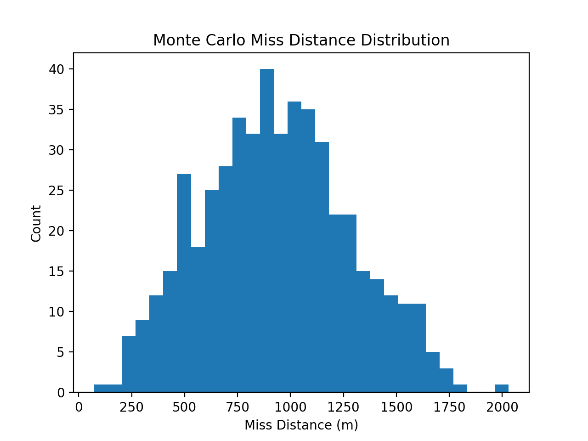

| Param | PNG(Base) | PNG(Tune_1) |
| --- | --- | --- |
| **Dt** | 0.01 | 0.005 |
| **TotalTime** | 80.0 | 80.0 |
| **NavigationGain** | np.random.uniform(2.5, 4.5) | np.random.uniform(2.5, 4.5) |
| **Simulation** | MonteCarlo(500) | MonteCarlo(500) |
| **Tau** | 0.15 | 0.15 |
| **MissDistance(Mean/Std)** | 894.13/349.35 | 933.27(⇡)/349.04(⇣) |

- 결과 해석: dt 변경은 요격 성공률 향상에 큰 영향을 미치지 않음을 확인可 ⇢ NavigationGain(N) 변경에 따른 성능 변화 확인 필요성有

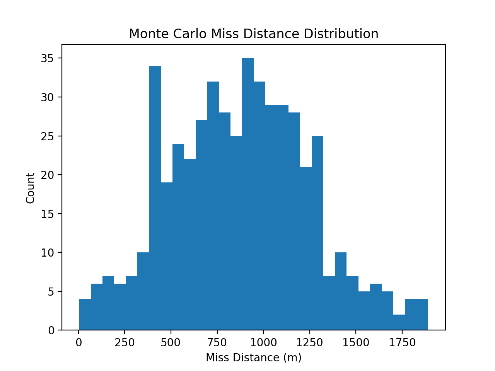

| Param | PNG(Base) | PNG(Tune_1) |
| --- | --- | --- |
| **Dt** | 0.01 | 0.01 |
| **TotalTime** | 80.0 | 80.0 |
| **NavigationGain** | np.random.uniform(2.5, 4.5) | np.random.uniform(4.0, 6.0) |
| **Simulation** | MonteCarlo(500) | MonteCarlo(500) |
| **Tau** | 0.15 | 0.15 |
| **MissDistance(Mean/Std)** | 894.13/349.35 | 873.88(⇣)/377.32(⇡) |

- 결과 해석: NavigationGain(N)은 요격 성공률 향상에 큰 영향을 미치지 않음을 확인可 ⇢ 비행 시간과 최대 가속도 조정 및 중력 가속도 보상 필요성有

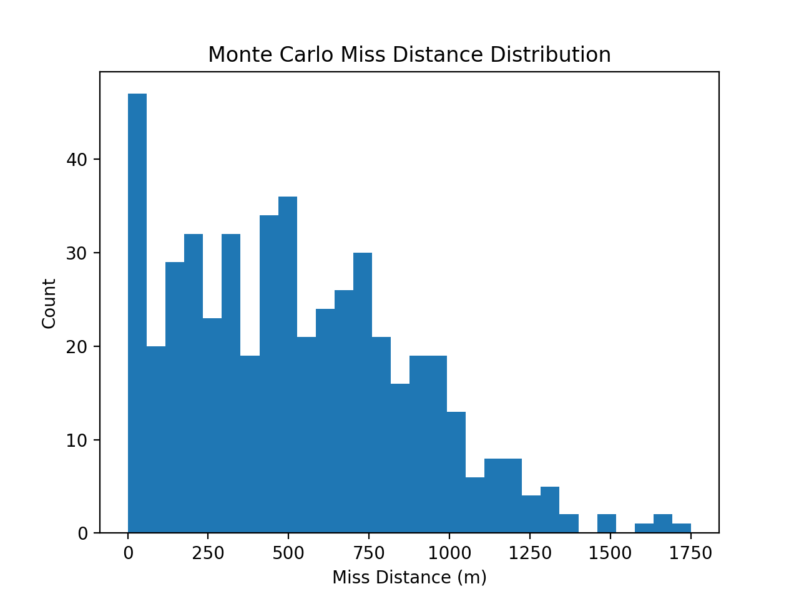

| Param | PNG(Base) | PNG(Tune_1) | PNG(Tune_2) | PNG(Tune_3) | PNG(Tune_4) | PNG(Tune_5) | PNG(Tune_6) | PNG(Tune_7) | PNG(Tune_8) | PNG(Tune_9) |
| --- | --- | --- | --- | --- | --- | --- | --- | --- | --- | --- |
| **Dt** | 0.01 | 0.01 | 0.01 | 0.01 | 0.01 | 0.01 | 0.01 | 0.01 | 0.01 | 0.01 |
| **TotalTime** | 30.0 | 30.0 | 30.0 | 30.0 | 30.0 | 30.0 | 30.0 | 30.0 | 30.0 | 30.0 |
| **NavigationGain** | np.random.uniform(2.5, 4.5) | np.random.uniform(2.5, 4.5) | np.random.uniform(2.5, 4.5) | np.random.uniform(2.5, 4.5) | np.random.uniform(2.5, 4.5) | np.random.uniform(2.5, 4.5) | np.random.uniform(2.5, 4.5) | np.random.uniform(2.5, 4.5) | np.random.uniform(2.5, 4.5) | np.random.uniform(2.5, 4.5) |
| **Simulation** | MonteCarlo(500) | MonteCarlo(500) | MonteCarlo(500) | MonteCarlo(500) | MonteCarlo(500) | MonteCarlo(500) | MonteCarlo(500) | MonteCarlo(500) | MonteCarlo(500) | MonteCarlo(500) |
| **MaxAccl** | 400 | 400 | 400 | 400 | 400 | 400 | 400 | 400 | 400 | 400 |
| **Tau** | 0.01 | 0.02 | 0.03 | 0.04 | 0.05 | 0.06 | 0.07 | 0.08 | 0.09 | 0.10 |
| **MissDistance(Mean/Std)** | 519.61/338.80 | 526.06(⇡)/358.46(⇡) | 564.91(⇡)/349.71(⇡) | 518.25(⇣)/350.98(⇡) | 523.54(⇡)/333.40(⇣) | 525.21(⇡)/323.78(⇣) | 536.97(⇡)/342.21(⇡) | 511.26(⇣)/346.89(⇡) | 526.50(⇡)/353.68(⇡) | 533.43(⇡)/354.58(⇡) |

- 결과 해석: (변수 변경 및 중력 가속도 보상처리 후) MissDistance가 감소함을 확인함, 다만 여전히 높은 수치를 보임

#### [Exp08]: Monte Carlo 시뮬레이션 고도화

- 목표: 현재의 '랜덤 반복 실행' 기반 Monte Carlo 시뮬레이션을 '불확실성' 기반 성능 강건성 분석으로 고도화
- 이유: 기존 Monte Carlo 시뮬레이션은 ① 비현실적인 랜덤 변수 설계 ② 단일 성능 지표 사용 ③ 변수별 민감도 분석X ④ 단일(랜덤 분포) 시나리오 사용 ⑤ 모델의 현실성 부족 ⑥ 재현성 확보X의 문제점 존재
- 일시: 2026.03.07

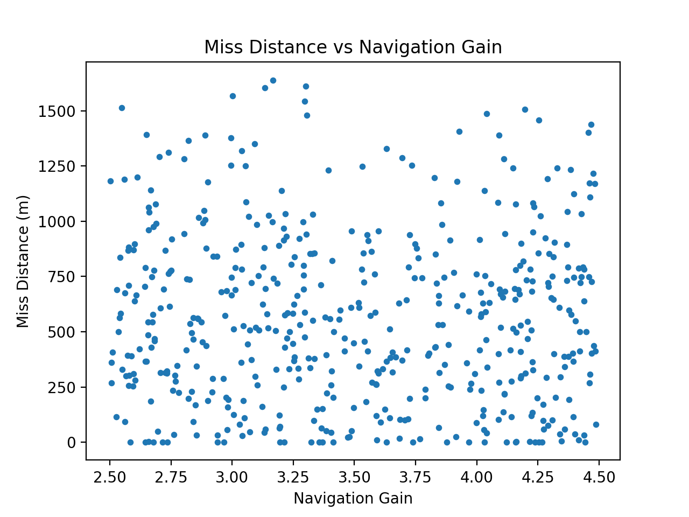

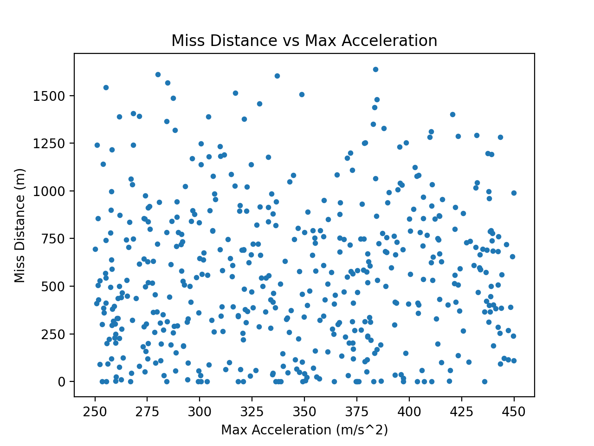

| Monte Carlo Result(Complex) |
| --- |
| **Runs** | 500 |
| **Mean Miss Distance** | 562.56 |
| **Std Miss Distance** | 385.47 |
| **Median Miss** | 532.19 |
| **P95 Miss Distance** | 1281.60 |
| **Min Miss Distance** | 1.00 |
| **Max Miss Distance** | 1638.40 |
| **Pk (<5m)** | 0.054 |
| **Pk (<10m)** | 0.058 |
| **Success Rate** | 0.054 |
| **Mean Intercept Time** | 29.67 |

- 결과 해석: 낮은 요격 성공률로 인해 시스템의 Robustness가 낮게 측정됨 ⇢ 각 변수가 결과에 미치는 영향을 독립적으로 파악할 필요有

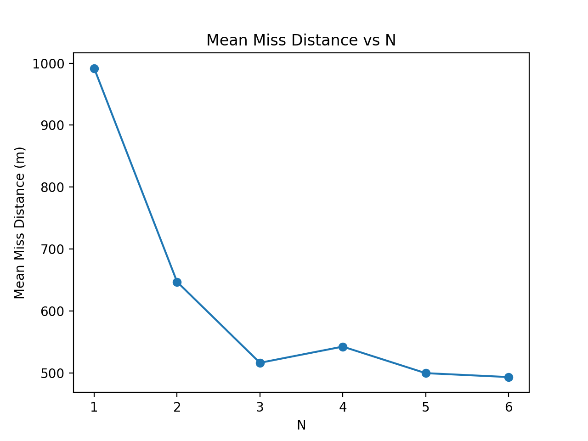

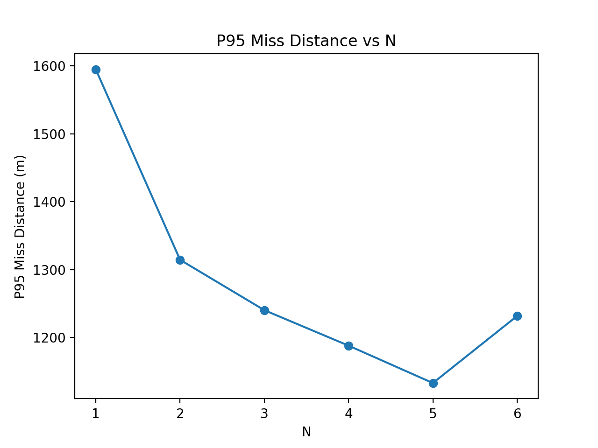

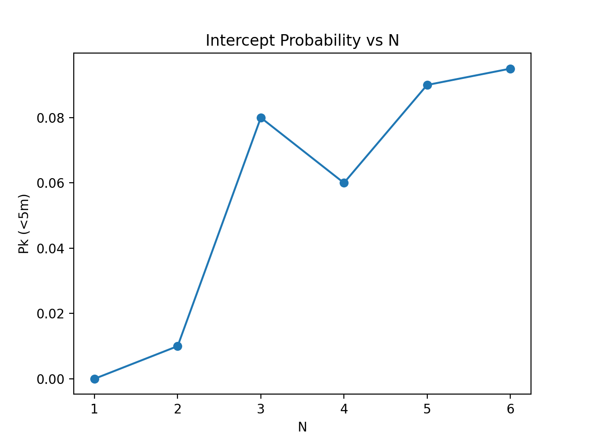

| Monte Carlo Result(with Fixed N) | Tune_1 | Tune_2 | Tune_3 | Tune_4 | Tune_5 | Tune_6 |
| --- | --- | --- | --- | --- | --- | --- |
| **NavagationGain** | 1 | 2 | 3 | 4 | 5 | 6 |
| **Runs** | 200 | 200 | 200 | 200 | 200 | 200 |
| **Mean Miss Distance** | 991.73 | 646.90 | 516.15 | 542.32 | 499.45 | 493.13 |
| **Std Miss Distance** | 358.13 | 345.82 | 387.93 | 394.11 | 369.99 | 409.57 |
| **Median Miss** | 988.87 | 623.14 | 453.93 | 513.21 | 452.74 | 427.08 |
| **P95 Miss Distance** | 1594.73 | 1524.39 | 1240.40 | 1188.17 | 1133.15 | 1231.87 |
| **Min Miss Distance** | 169.56 | 1.04 | 1.01 | 1.02 | 1.01 | 1.02 |
| **Max Miss Distance** | 1893.47 | 1833.24 | 1663.70 | 1647.85 | 1992.27 | - |
| **Pk (<5m)** | 0.000 | 0.010 | 0.080 | 0.060 | 0.090 | 0.095 |
| **Pk (<10m)** | 0.000 | 0.010 | 0.080 | 0.065 | 0.100 | 0.095 |
| **Success Rate** | 0.000 | **0.010(⇡)** | **0.080(⇡)** | **0.060(⇡)** | **0.090(⇡)** | **0.095(⇡)** |
| **Mean Intercept Time** | 30.00 | 29.96 | 29.48 | 29.67 | 29.51 | 29.50 |

- 결과 해석: N 변화는 요격 성능에 영향을 미침 ⇢ 현재 설정에서는 N(5)에서 가장 안정적인 요격 성능을 보임

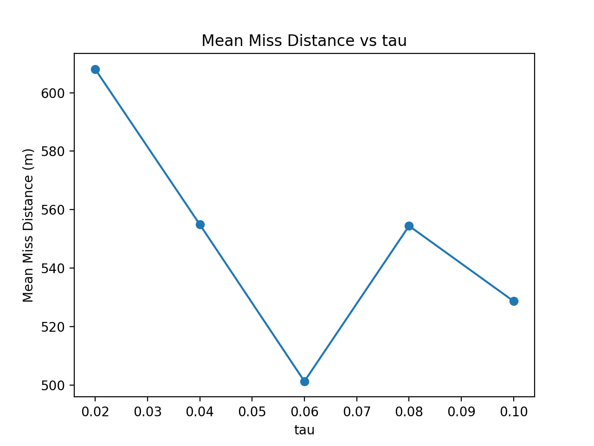

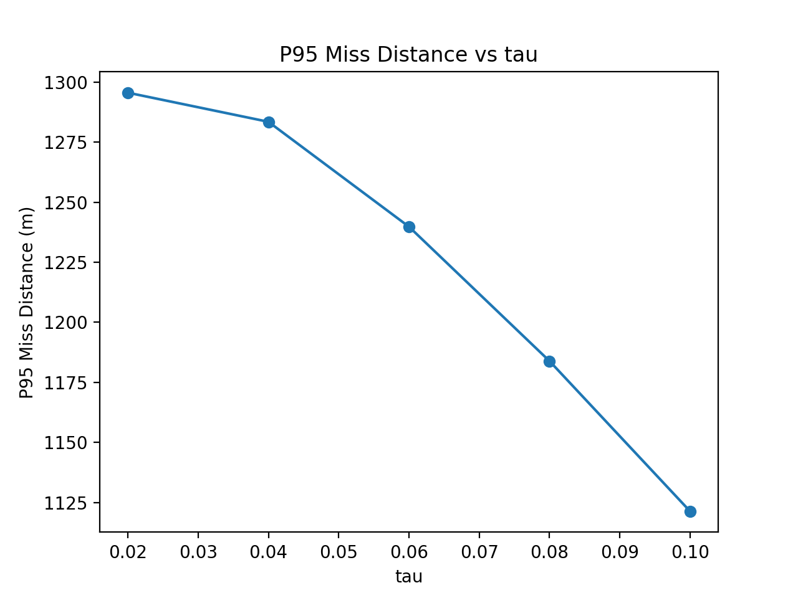

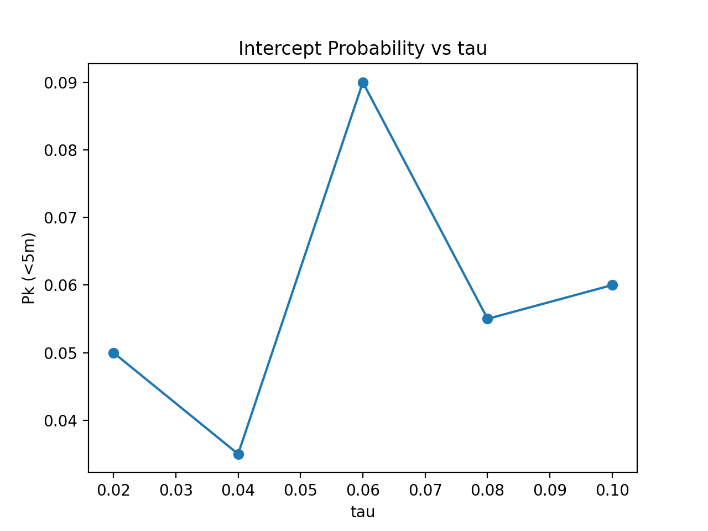

| Monte Carlo Result(with Fixed tau) | Tune_1 | Tune_2 | Tune_3 | Tune_4 | Tune_5 |
| --- | --- | --- | --- | --- | --- |
| **Tau** | 0.02 | 0.04 | 0.06 | 0.08 | 0.10 |
| **Runs** | 200 | 200 | 200 | 200 | 200 |
| **Mean Miss Distance** | 608.87 | 554.90 | 501.23 | 554.43 | 528.64 |
| **Std Miss Distance** | 386.87 | 366.75 | 392.35 | 387.36 | 354.11 |
| **Median Miss** | 573.21 | 519.39 | 448.90 | 527.86 | 493.50 |
| **P95 Miss Distance** | 1295.60 | 1283.48 | 1239.80 | 1183.85 | 1121.32 |
| **Min Miss Distance** | 1.04 | 1.00 | 1.02 | 1.00 | 1.00 |
| **Max Miss Distance** | 1646.62 | 1513.60 | 1832.43 | 1646.17 | 1589.85 |
| **Pk (<5m)** | 0.050 | 0.035 | 0.090 | 0.055 | 0.060 |
| **Pk (<10m)** | 0.050 | 0.045 | 0.090 | 0.055 | 0.060 |
| **Success Rate** | 0.050 | 0.035(⇣) | **0.090(⇡)** | **0.055(⇡)** | **0.060(⇡)** |
| **Mean Intercept Time** | 29.65 | 29.82 | 29.37 | 29.68 | 29.61 |

- 결과 해석: tau 변화는 요격 성능에 영향을 미침 ⇢ 현재 설정에서는 tau(0.06)에서 가장 안정적인 요격 성능을 보임

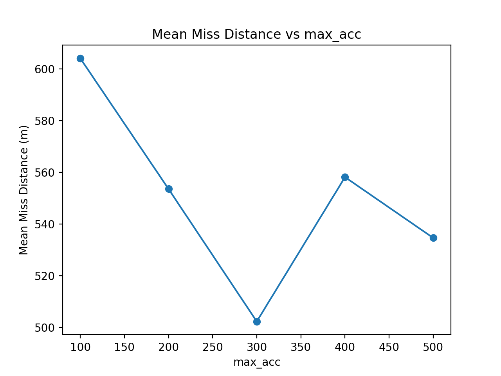

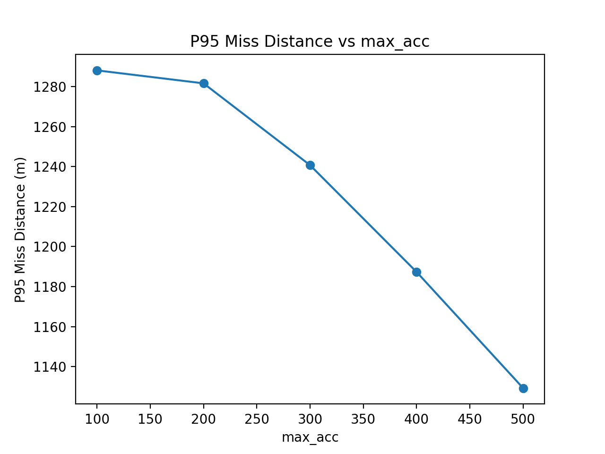

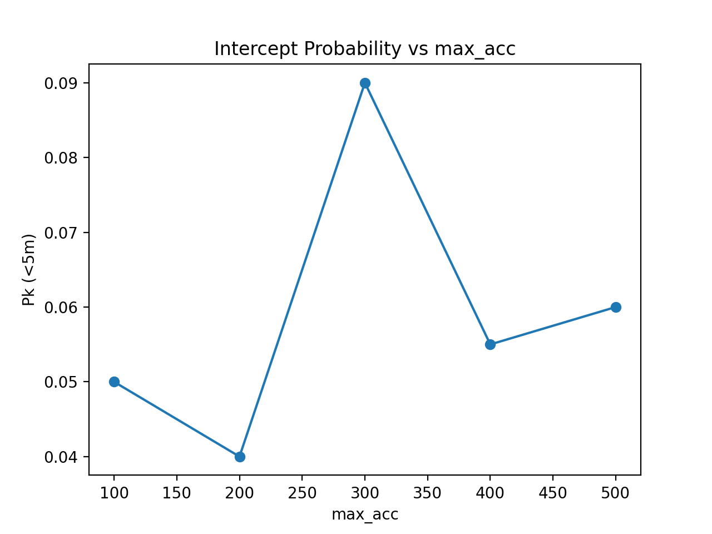

| Monte Carlo Result(with Fixed max_acc) | Tune_1 | Tune_2 | Tune_3 | Tune_4 | Tune_5 |
| --- | --- | --- | --- | --- | --- |
| **MaxAcc** | 100 | 200 | 300 | 400 | 500 |
| **Runs** | 200 | 200 | 200 | 200 | 200 |
| **Mean Miss Distance** | 604.10 | 553.58 | 502.34 | 558.14 | 534.64 |
| **Std Miss Distance** | 385.68 | 366.46 | 392.67 | 388.18 | 355.60 |
| **Median Miss** | 570.98 | 517.49 | 449.66 | 529.83 | 499.25 |
| **P95 Miss Distance** | 1288.07 | 1281.60 | 1240.68 | 1187.27 | 1129.20 |
| **Min Miss Distance** | 0.97 | 1.00 | 1.03 | 1.02 | 1.06 |
| **Max Miss Distance** | 1638.40 | 1513.94 | 1835.14 | 1648.37 | 1597.26 |
| **Pk (<5m)** | 0.050 | 0.040 | 0.090 | 1.02 | 0.060 |
| **Pk (<10m)** | 0.055 | 0.045 | 0.090 | 0.055 | 0.060 |
| **Success Rate** | 0.050 | 0.040(⇣) | **0.090(⇡)** | **0.055(⇡)** | **0.060(⇡)** |
| **Mean Intercept Time** | 29.72 | 29.82 | 29.37 | 29.69 | 29.62 |

- 결과 해석: max_acc 변화는 요격 성능에 영향을 미침 ⇢ 현재 설정에서는 max_acc(300)에서 가장 안정적인 요격 성능을 보임, 또한 N(navigation gain), tau(autopilot time constant), max_acc(maximum acceleration) 중 max_acc 변화에 따라 miss distance(직관적 성능 지표) 및 intercept probability(실무적 성능 지표) 값의 큰 변화가 있어 요격 성능에 가장 민감한 변수임을 알 수 있음

#### [Exp09]: EKF(Extended Karman Filter) 적용

- 목표: EKF 적용을 통한 모델의 현실성 향상
- 이유: 기존의 PN은 미사일이 표적의 위치·속도를 정확히 알고 있다는 가정 하에 계산됨, 다만 현실에서는 표적의 위치·속도를 파악하기 위한 센서 측정값에 오차·노이즈가 존재함
- 일시: 2026.03.08

##### 현재 구조
```
true target state → guidance → control → dynamics
```

##### 변경 구조(단계1: Sensor Noise 추가)
```
true target state → sensor measurement(noise) → guidance → control → dynamics
```

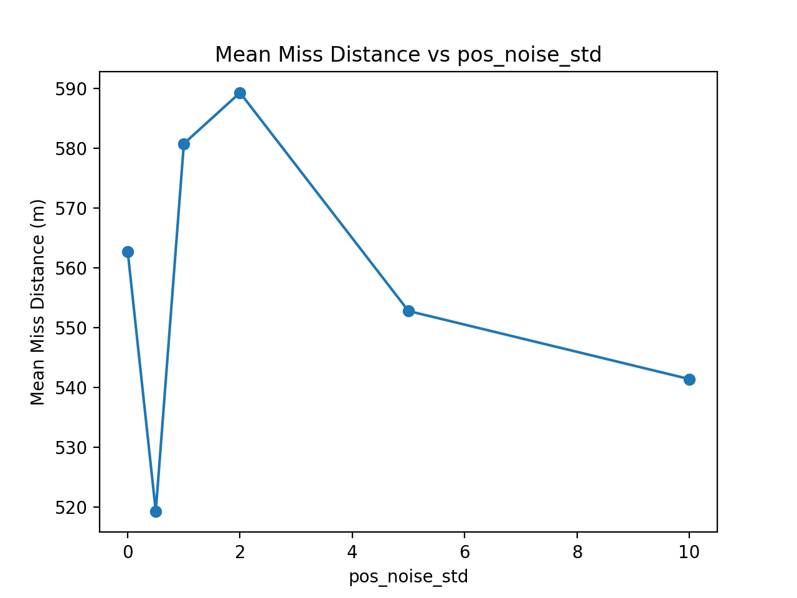

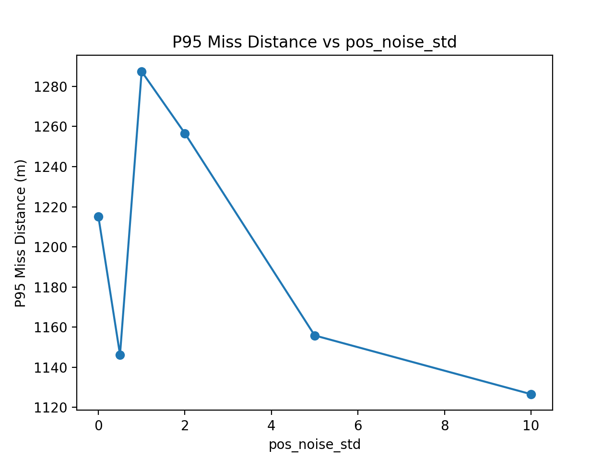

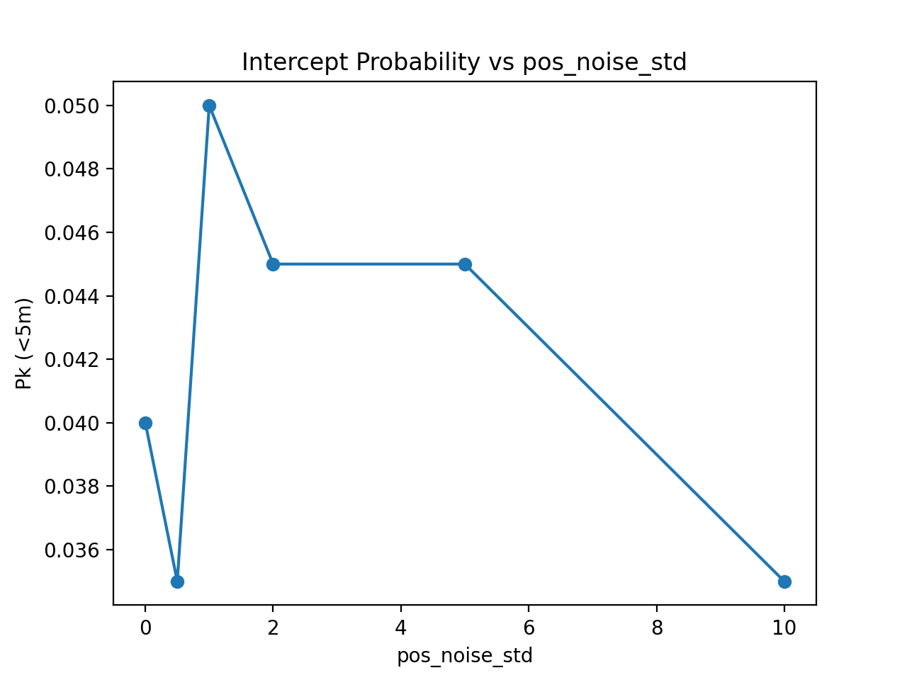

| Monte Carlo Result(with Fixed position_noise) | Tune_1 | Tune_2 | Tune_3 | Tune_4 | Tune_5 | Tune_6 |
| --- | --- | --- | --- | --- | --- | --- |
| **PosNoise** | 0 | 0.5 | 1 | 2 | 5 | 10 |
| **Runs** | 200 | 200 | 200 | 200 | 200 | 200 |
| **Mean Miss Distance** | 562.76 | 519.25 | 580.80 | 589.33 | 552.78 | 541.39 |
| **Std Miss Distance** | 383.15 | 358.21 | 389.53 | 380.88 | 372.81 | 346.05 |
| **Median Miss** | 542.16 | 428.39 | 558.41 | 548.11 | 521.97 | 532.55 |
| **P95 Miss Distance** | 1215.19 | 1146.24 | 1287.45 | 1256.59 | 1155.86 | 1126.60 |
| **Min Miss Distance** | 0.99 | 1.03 | 1.02 | 1.03 | 1.14 | 1.31 |
| **Max Miss Distance** | 1628.85 | 1552.31 | 2020.82 | 1830.12 | 1553.21 | 1904.74 |
| **Pk (<5m)** | 0.040 | 0.035 | 0.050 | 0.045 | 0.045 | 0.035 |
| **Pk (<10m)** | 0.045 | 0.040 | 0.050 | 0.045 | 0.045 | 0.045 |
| **Success Rate** | 0.040 | 0.035(⇣) | **0.050(⇡)** | 0.045 | 0.045 | 0.035(⇣) |
| **Mean Intercept Time** | 29.84 | 29.82 | 29.73 | 29.75 | 29.94 | 30.00 |

- 결과 해석: positon_noise 변화는 요격 성능에 영향을 미침 ⇢ 현재 설정에서는 positon_noise(1)에서 가장 안정적인 요격 성능을 보임

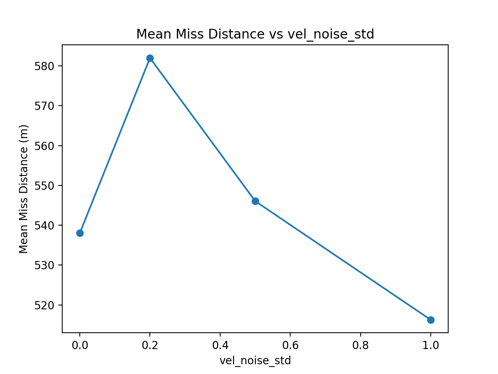

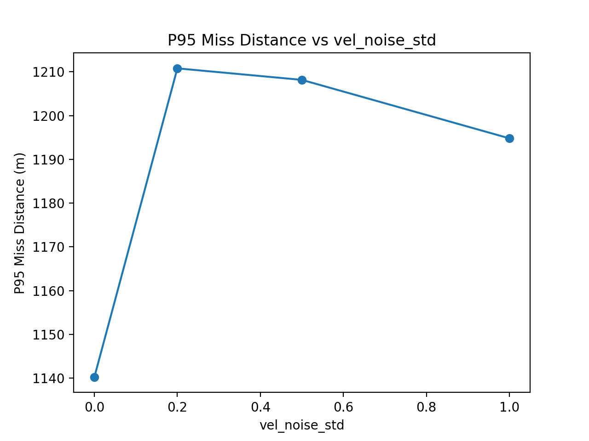

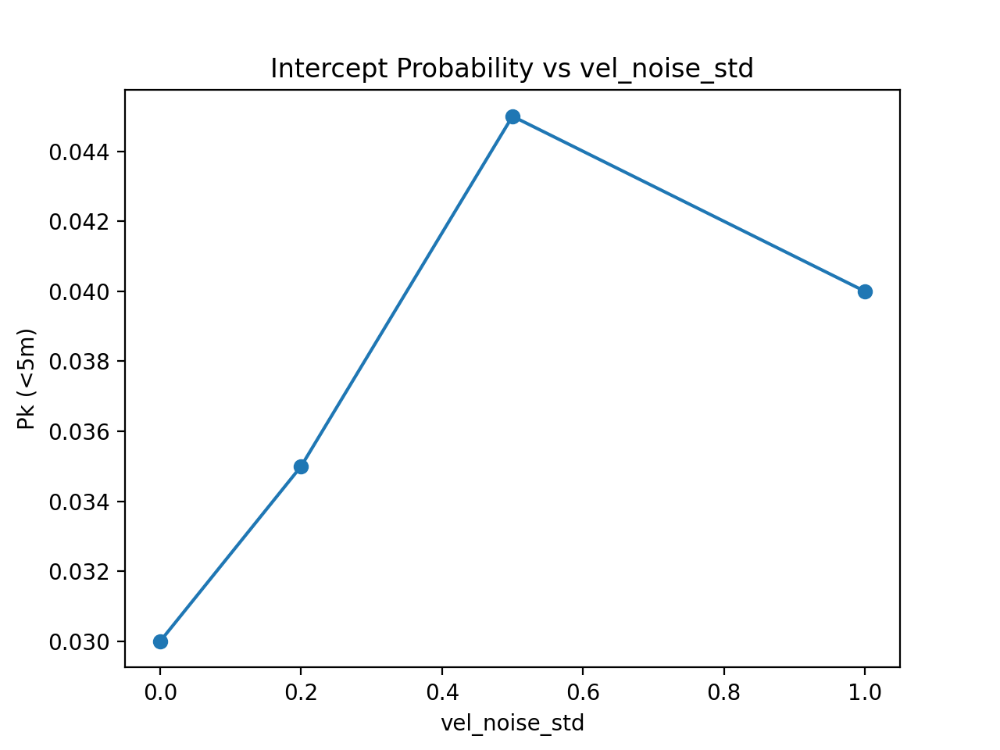

| Monte Carlo Result(with Fixed velocity_noise) | Tune_1 | Tune_2 | Tune_3 | Tune_4 |
| --- | --- | --- | --- | --- |
| **VelNoise** | 0 | 0.2 | 0.5 | 1 |
| **Runs** | 200 | 200 | 200 | 200 |
| **Mean Miss Distance** | 538.02 | 581.97 | 546.04 | 516.28 |
| **Std Miss Distance** | 326.81 | 371.03 | 382.44 | 374.40 |
| **Median Miss** | 479.37 | 550.19 | 478.51 | 460.20 |
| **P95 Miss Distance** | 1140.27 | 1210.78 | 1208.15 | 1194.80 |
| **Min Miss Distance** | 0.97 | 1.03 | 1.00 | 1.04 |
| **Max Miss Distance** | 1479.36 | 1634.46 | 1567.22 | 2053.76 |
| **Pk (<5m)** | 0.030 | 0.035 | 0.045 | 0.040 |
| **Pk (<10m)** | 0.045 | 0.035 | 0.060 | 0.055 |
| **Success Rate** | 0.030 | **0.035(⇡)** | **0.045(⇡)** | **0.040(⇡)** |
| **Mean Intercept Time** | 29.86 | 29.95 | 29.88 | 29.90 |

- 결과 해석: velocity_noise 변화는 요격 성능에 영향을 미침 ⇢ 현재 설정에서는 velocity_noise(0.5)에서 가장 안정적인 요격 성능을 보임

##### 변경 구조(단계2: EKF 추가)
```
true target state → sensor measurement(noise) → EKF → estimated target → guidance → control → dynamics
```

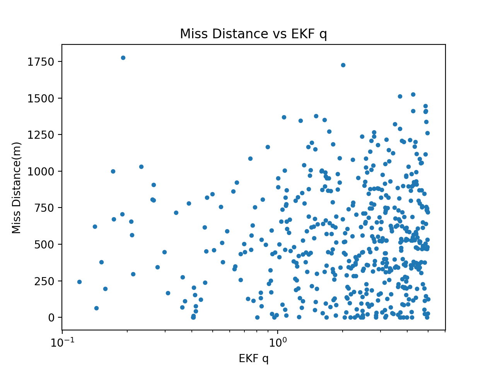

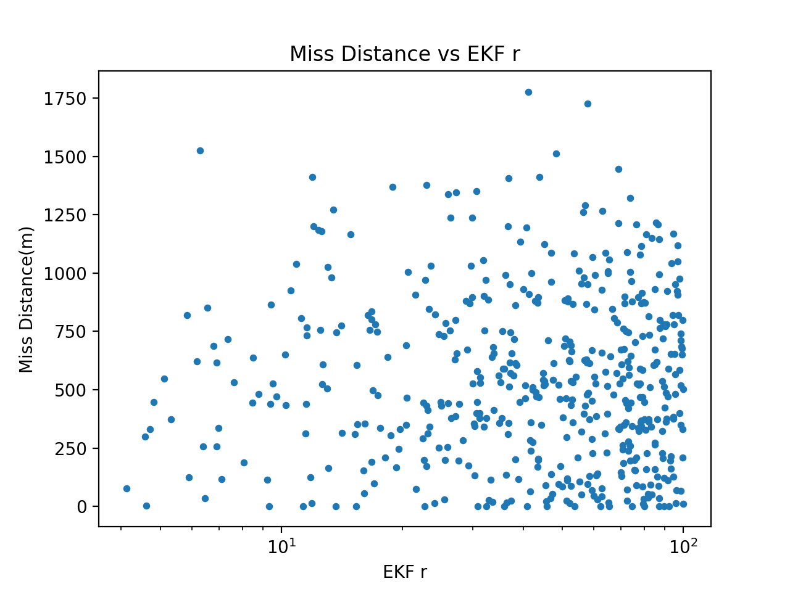

| Monte Carlo Result(Complex) |
| --- |
| **Runs** | 500 |
| **Mean Miss Distance** | 537.31 |
| **Std Miss Distance** | 362.52 |
| **Median Miss** | 511.36 |
| **P95 Miss Distance** | 1199.54 |
| **Min Miss Distance** | 1.00 |
| **Max Miss Distance** | 1776.83 |
| **Pk (<5m)** | 0.038 |
| **Pk (<10m)** | 0.038 |
| **Success Rate** | 0.038 |
| **Mean Intercept Time** | 29.76 |

- 결과 해석: (sensor noise + EKF 적용 후) 적용 전보다 요격 성공률이 낮아짐을 확인可

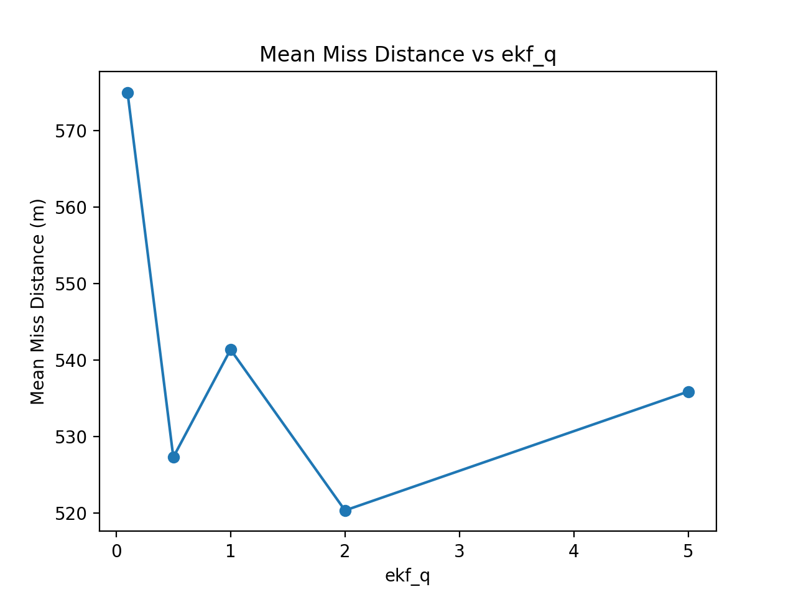

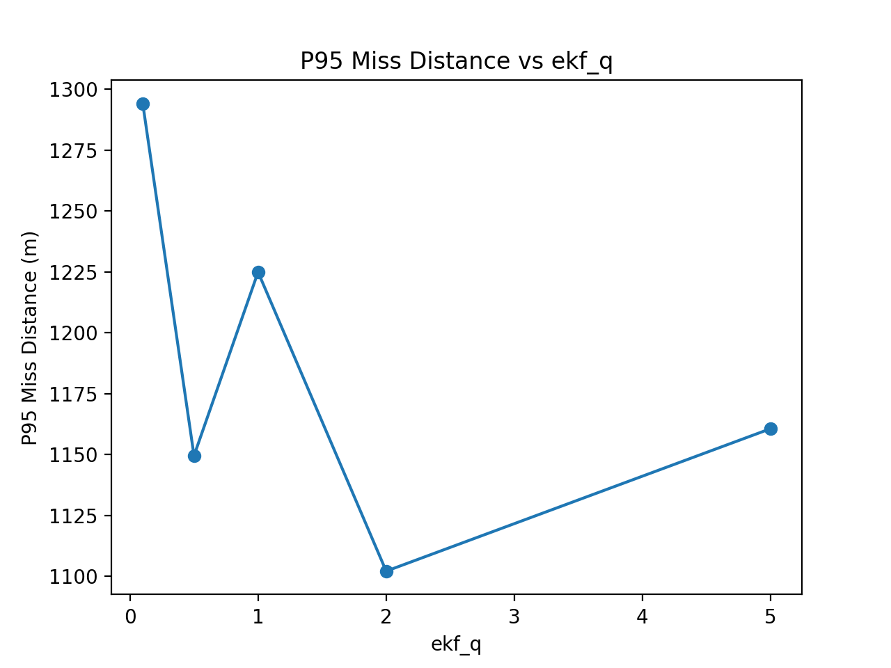

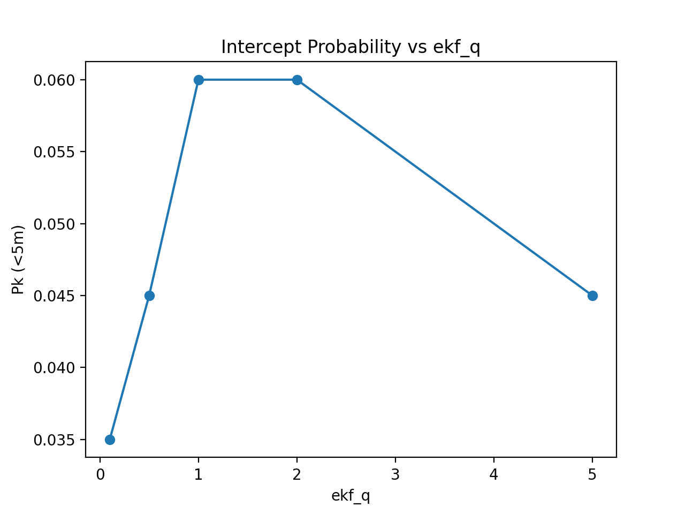

| Monte Carlo Result(with Fixed ekf_q) | Tune_1 | Tune_2 | Tune_3 | Tune_4 | Tune_5 |
| --- | --- | --- | --- | --- | --- |
| **EKF(q)** | 0.1 | 0.5 | 1 | 2 | 5 |
| **Runs** | 200 | 200 | 200 | 200 | 200 |
| **Mean Miss Distance** | 574.96 | 527.27 | 541.35 | 520.31 | 535.86 |
| **Std Miss Distance** | 382.47 | 347.36 | 379.34 | 345.63 | 353.64 |
| **Median Miss** | 521.68 | 503.68 | 490.29 | 499.94 | 519.71 |
| **P95 Miss Distance** | 1294.10 | 1149.49 | 1224.89 | 1102.07 | 1160.57 |
| **Min Miss Distance** | 1.03 | 1.02 | 1.00 | 1.03 | 1.01 |
| **Max Miss Distance** | 1611.22 | 1797.67 | 2031.13 | 1413.92 | 1684.30 |
| **Pk (<5m)** | 0.035 | 0.045 | 0.060 | 0.060 | 0.045 |
| **Pk (<10m)** | 0.035 | 0.045 | 0.060 | 0.060 | 0.045 |
| **Success Rate** | 0.035 | **0.045(⇡)** | **0.060(⇡)** | **0.060(⇡)** | **0.045(⇡)** |
| **Mean Intercept Time** | 29.90 | 29.80 | 29.67 | 29.71 | 29.79 |

- 결과 해석: ekf_q 변화는 요격 성능에 영향을 미침 ⇢ 현재 설정에서는 ekf_q(2)에서 가장 안정적인 요격 성능을 보임

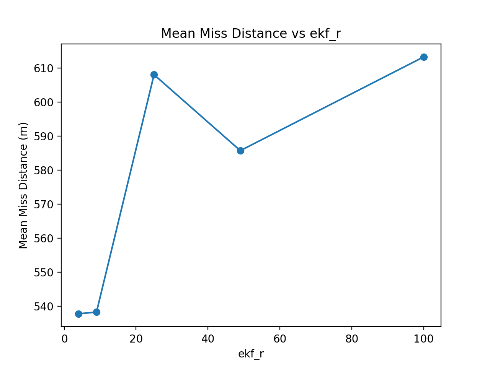

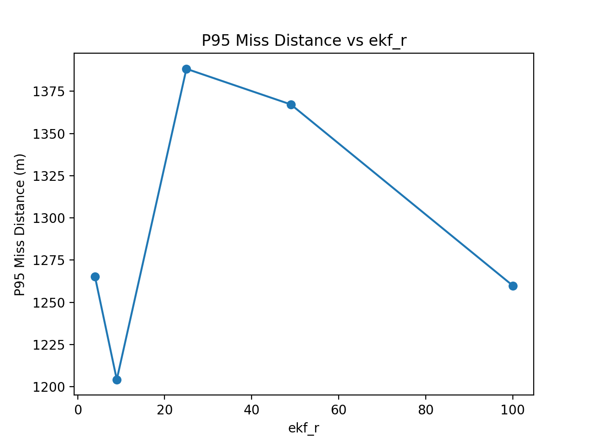

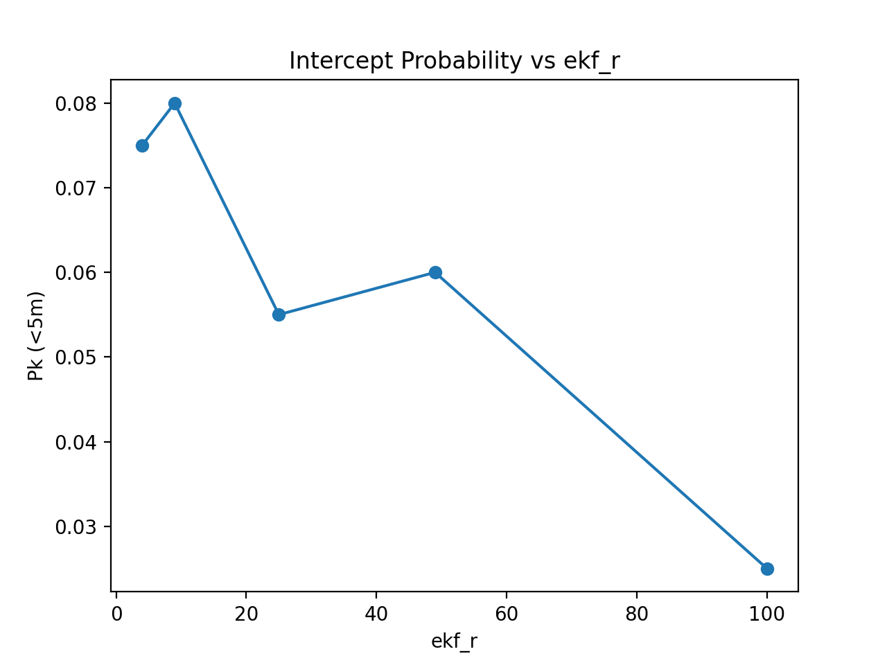

| Monte Carlo Result(with Fixed ekf_r) | Tune_1 | Tune_2 | Tune_3 | Tune_4 | Tune_5 |
| --- | --- | --- | --- | --- | --- |
| **EKF(r)** | 4 | 9 | 25 | 49 | 100 |
| **Runs** | 200 | 200 | 200 | 200 | 200 |
| **Mean Miss Distance** | 537.78 | 538.28 | 608.08 | 585.75 | 613.31 |
| **Std Miss Distance** | 388.19 | 381.52 | 430.35 | 388.69 | 385.07 |
| **Median Miss** | 496.00 | 503.58 | 512.30 | 575.76 | 570.52 |
| **P95 Miss Distance** | 1265.13 | 1204.20 | 1388.32 | 1367.21 | 1259.89 |
| **Min Miss Distance** | 1.01 | 1.02 | 1.00 | 1.01 | 1.07 |
| **Max Miss Distance** | 1634.04 | 1610.61 | 1904.88 | 1811.83 | 1767.50 |
| **Pk (<5m)** | 0.075 | 0.080 | 0.055 | 0.060 | 0.025 |
| **Pk (<10m)** | 0.075 | 0.085 | 0.060 | 0.065 | 0.030 |
| **Success Rate** | 0.075 | **0.080(⇡)** | 0.055(⇣) | 0.060(⇣) | 0.025(⇣) |
| **Mean Intercept Time** | 29.68 | 29.45 | 29.71 | 29.64 | 29.89 |

- 결과 해석: ekf_r 변화는 요격 성능에 영향을 미침 ⇢ 현재 설정에서는 ekf_r(9)에서 가장 안정적인 요격 성능을 보임