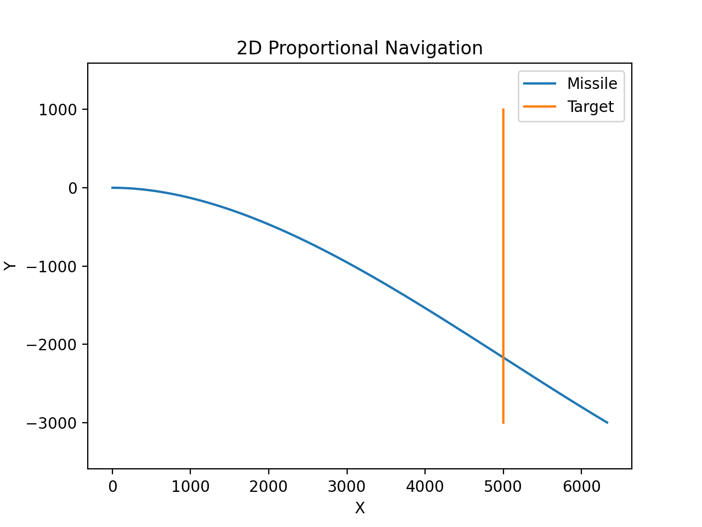
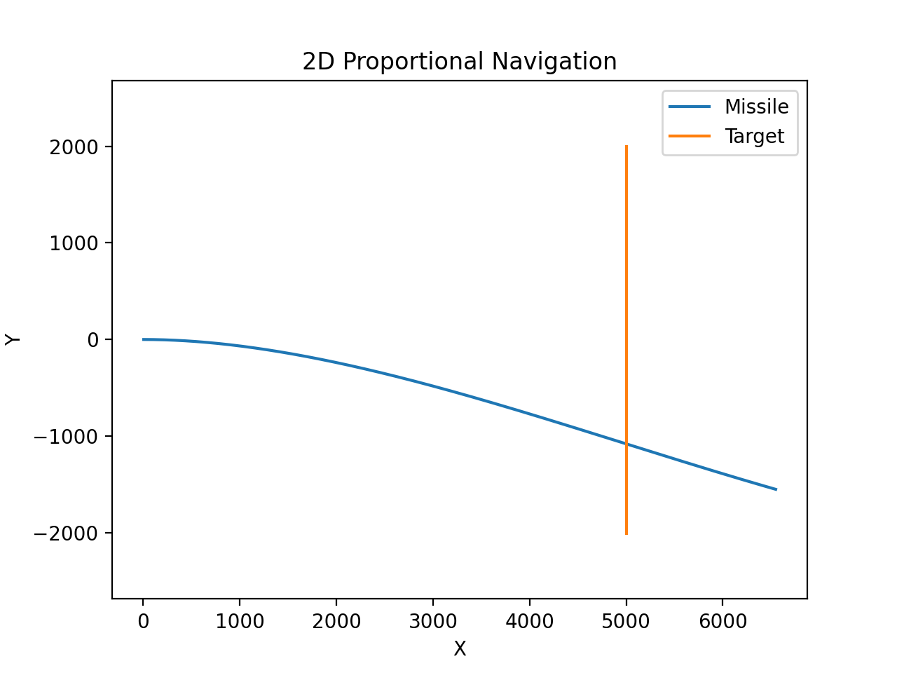
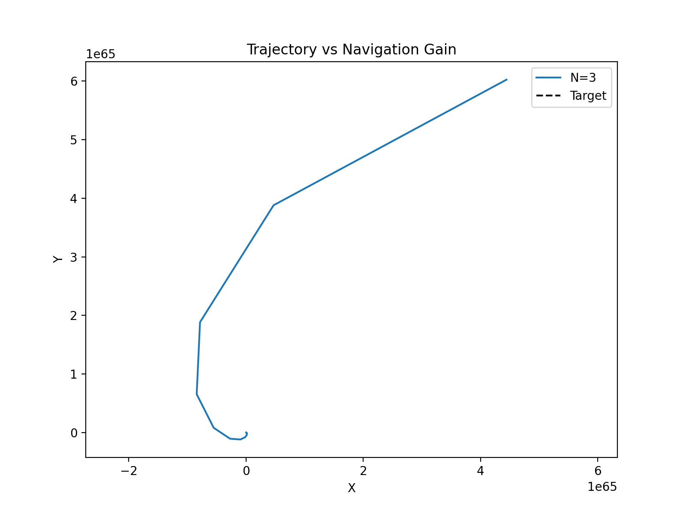
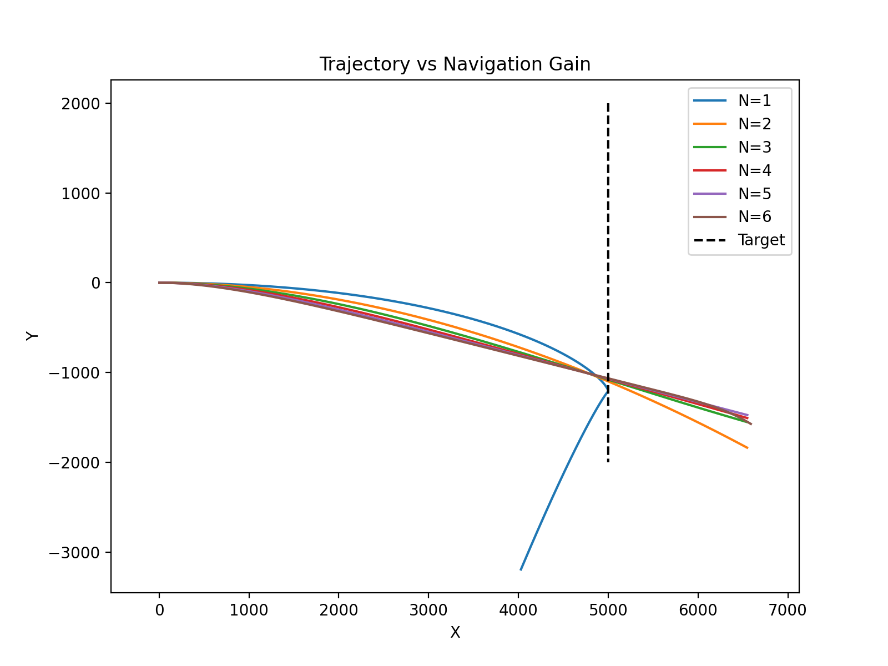
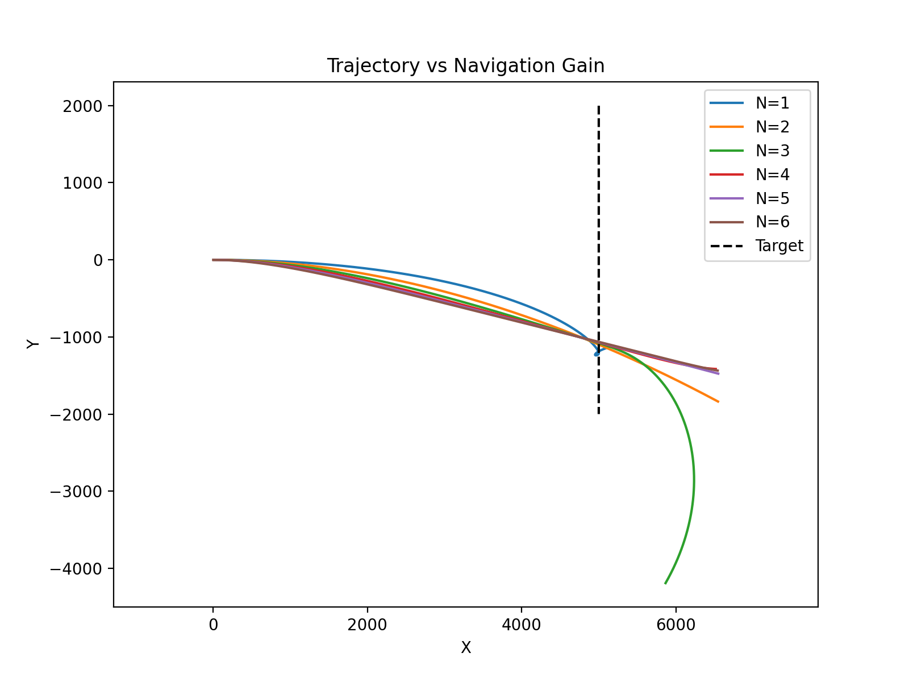
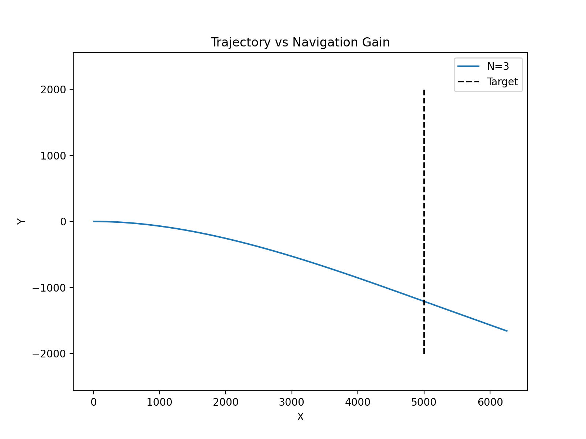
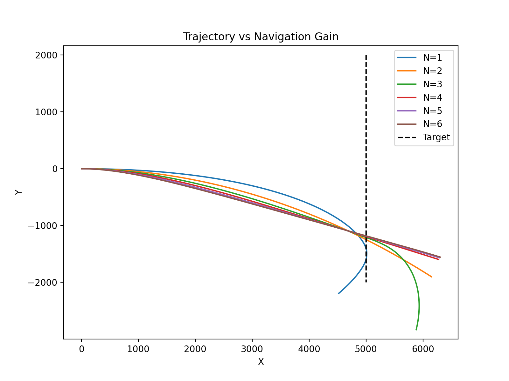
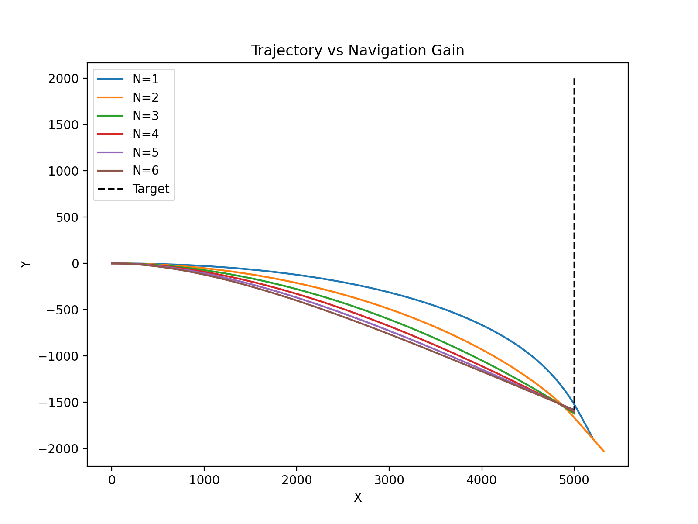
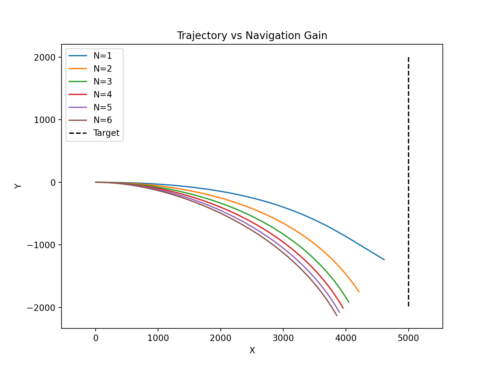
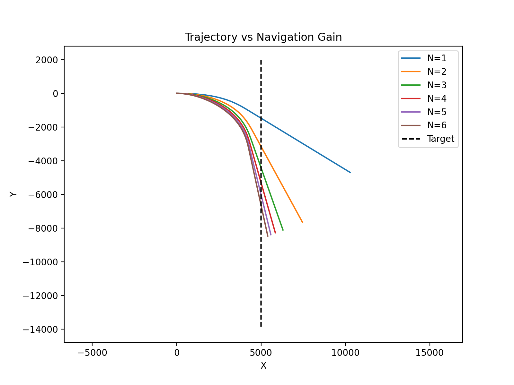

# 📡 Algorithm_Design_And_Monte_CarloAnalysis

### 0. 개요

- 목표: **6-DOF(Degree of Freedom)** 기반의 **유도조종 알고리즘 설계 및 몬테카를로 성능 분석**

- 기대효과: ① 실제 산업 현장에서 유도무기 성능 분석에 필요한 도메인 지식 획득 ② 실산업에 적용 가능한 인사이트 획득

### 1. 설계구조 및 실험환경

- 설계구조(베이스라인)
```
src/
│
├── main.py
│   └─ 시뮬레이션 실행 진입점(객체 생성, 시뮬레이션 실행, miss distance 계산, 결과 출력 및 시각화)
│
├── config.py
│   └─ 시뮬레이션 전역 설정값(dt, 총 시간, 항법 이득 등) 관리
│
├── simulation.py
│   └─ 시뮬레이션 엔진(시간 루프, 유도→제어→동역학 업데이트 흐름 제어, 히스토리 저장)
│
├── models/
│   ├── __init__.py
│   │   └─ 패키지 초기화 파일(모듈 import 경로 구성)
│   │
│   ├── base.py
│   │   └─ 동역학 모델 공통 인터페이스 정의(step 메서드 강제)
│   │
│   ├── missile.py
│   │   └─ 미사일 2D 동역학 모델(위치·속도·가속도 명령 상태 및 시간 적분)
│   │
│   └── target.py
│       └─ 표적 2D 동역학 모델(위치·속도 상태 및 시간 적분)
│
├── guidance/
│   ├── __init__.py
│   │   └─ 패키지 초기화 파일
│   │
│   ├── base.py
│   │   └─ 유도법칙 공통 인터페이스 정의(compute_command 강제)
│   │
│   └── png.py
│       └─ Proportional Navigation 구현(LOS rate 기반 가속도 명령 계산)
│
├── control/
│   ├── __init__.py
│   │   └─ 패키지 초기화 파일
│   │
│   ├── base.py
│   │   └─ 제어기 공통 인터페이스 정의(update 강제)
│   │
│   └── ideal_controller.py
│       └─ 이상적 가속도 응답 모델(명령 가속도를 즉시 적용)
│
└── analysis/
    ├── __init__.py
    │   └─ 패키지 초기화 파일
    │
    └── metrics.py
        └─ 성능 분석 함수(miss distance 계산 등 평가 지표 정의)

```

| Param | Unit |
| --- | --- |
| **위치(pos)** | m |
| **거리(vel)** | m/s |
| **가속도(acc)** | m/s<sup>2</sup> |
| **시간(t/dt)** | s |
| **LOS Rate** | rad/s |

- 실험환경: MacBook Pro
 
 | About | Specification |
 | --- | --- |
 | **OS** | 13.7.8 |
 | **Processor** | 2.3GHz Dual-Core Intel Core i5 |
 | **Graphic** | Intel Iris+ Graphics 640 1536MB |
 | **Memory** | 8GB 2133MHz LPDDR3 |

### 2. 실험 내용

#### [Exp01]: Baseline

- 목표: Baseline의 성능 확인
- 이유: 추후 연구 필요성 확인
- 일시: 2026.03.05

| Param | PNG(Base) |
| --- | --- |
| **Dt** | 0.01 |
| **TotalTime** | 20.0 |
| **NavigationGain** | 3.0 |
| **Vel(Missile(X),Target(X))**| (300, 250) | [(300, 250) | (300, 250) | (300, 250) | (300, 250) | (300, 250) |
| **MissDistance** | 4121.55 |

#### [Exp02]: NavigationGain(N)

- 목표: NavigationGain(N) 변화에 따른 유도 성능 확인
- 이유: Miss Distance를 최소화하기 위해 NavigationGain 변수 조정可
- 일시: 2026.03.05

| Param | PNG(Base) | PNG(Tune_1) | PNG(Tune_2) | PNG(Tune_3) | PNG(Tune_4) | PNG(Tune_5) |
| --- | --- | --- | --- | --- | --- | --- |
| **Dt** | 0.01 | 0.01 | 0.01 | 0.01 | 0.01 | 0.01 |
| **TotalTime** | 20.0 | 20.0 | 20.0 | 20.0 | 20.0 | 20.0 |
| **NavigationGain** | 3.0 | 1.0 | 2.0 | 4.0 | 5.0 | 6.0 |
| **Vel(Missile(X),Target(X))**| (300, 250) | [(300, 250) | (300, 250) | (300, 250) | (300, 250) | (300, 250) |
| **MissDistance** | 4121.55 | 4122.48(⇡) | 4121.97(⇡) | **4121.21(⇣)** | **4120.92(⇣)** | **4120.68(⇣)** |

- 결과 해석: 미사일과 표적이 거의 같은 방향으로 비행할 때 초기 각속도(λ)가 0에 수렴 ⇢ PN 가속도 0에 수렴 ⇢ 미사일은 단순 추적 상태 ⇢ 요격不可

#### [Exp03]: 초기 기하 조건

- 목표: 초기 기하 조건 변경에 따른 유도 성능 확인
- 이유: 표적 진행방향의 측면에서 미사일이 발사되어야 LOS Rate 발생可(서로 나란한 경우 LOS Rate가 0에 수렴함)
- 일시: 2026.03.05

| Param | PNG(Base) | PNG(Tune_1) | PNG(Tune_2) | PNG(Tune_3) | PNG(Tune_4) | PNG(Tune_5) |
| --- | --- | --- | --- | --- | --- | --- |
| **Dt** | 0.01 | 0.01 | 0.01 | 0.01 | 0.01 | 0.01 |
| **TotalTime** | 20.0 | 20.0 | 20.0 | 20.0 | 20.0 | 20.0 |
| **NavigationGain** | 3.0 | 1.0 | 2.0 | 4.0 | 5.0 | 6.0 |
| **Vel(Missile(X),Target(Y))**| (300, -200) | (300, -200) | (300, -200) | (300, -200) | (300, -200) | (300, -200) |
| **MissDistance** | 0.00 | 0.39(⇡) | 1.46(⇡) | 0.13(⇡) | 0.52(⇡) | 1.64(⇡) |

- 결과 해석: ① N(3 or 4): 안정적 요격可 ② N(1 or 2): 대부분 요격 실패 ③ N(5 or 6): 과도한 가속도가 요구되어 궤적이 급격히 휘어짐(실제 상황에서 불안정함)

#### [Exp04]: 적분 함수 변경

- 목표: 적분 함수 변경에 따른 유도 성능 확인
- 이유: RK4 적분은 Euler 적분에 비해 **dt 변화**에 덜 민감하고 **궤적 왜곡률**이 낮아 높은 **실무 적합성**을 보일 것으로 기대됨
- 일시: 2026.03.05



| Param | PNG(Base) | PNG(Tune_1) | PNG(Tune_2) | PNG(Tune_3) | PNG(Tune_4) | PNG(Tune_5) | PNG(Tune_6) | PNG(Tune_7) | PNG(Tune_8) | PNG(Tune_9) |
| --- | --- | --- | --- | --- | --- | --- | --- | --- | --- | --- |
| **Dt** | 0.01 | 0.02 | 0.03 | 0.04 | 0.05 | 0.06 | 0.07 | 0.08 | 0.09 | 0.1 |
| **TotalTime** | 20.0 | 20.0 | 20.0 | 20.0 | 20.0 | 20.0 | 20.0 | 20.0 | 20.0 | 20.0 |
| **NavigationGain** | 3.0 | 3.0 | 3.0 | 3.0 | 3.0 | 3.0 | 3.0 | 3.0 | 3.0 | 3.0 |
| **Vel(Missile(X),Target(Y))**| (300, -200) | (300, -200) | (300, -200) | (300, -200) | (300, -200) | (300, -200) | (300, -200) | (300, -200) | (300, -200) | (300, -200) |
| **적분 함수** | Euler | Euler | Euler | Euler | Euler | Euler | Euler | Euler | Euler | Euler |
| **MissDistance** | 0.68 | **0.04(0.64⇣)** | **0.59(0.09⇣)** | 1.22(0.54⇡) | 5.04(4.36⇡) | 2.48(1.80⇡) | 3.28(2.60⇡) | 3.73(3.05⇡) | 4.35(3.67⇡) | 7.81(7.13⇡) |

- 결과 해석: Euler 성능 민감도(평균 상대오차값)가 **0.67**로 낮은 수치 신뢰성을 가짐을 확인可


| Param | PNG(Base) | PNG(Tune_1) | PNG(Tune_2) | PNG(Tune_3) | PNG(Tune_4) | PNG(Tune_5) | PNG(Tune_6) | PNG(Tune_7) | PNG(Tune_8) | PNG(Tune_9) |
| --- | --- | --- | --- | --- | --- | --- | --- | --- | --- | --- |
| **Dt** | 0.01 | 0.02 | 0.03 | 0.04 | 0.05 | 0.06 | 0.07 | 0.08 | 0.09 | 0.1 |
| **TotalTime** | 20.0 | 20.0 | 20.0 | 20.0 | 20.0 | 20.0 | 20.0 | 20.0 | 20.0 | 20.0 |
| **NavigationGain** | 3.0 | 3.0 | 3.0 | 3.0 | 3.0 | 3.0 | 3.0 | 3.0 | 3.0 | 3.0 |
| **Vel(Missile(X),Target(Y))**| (300, -200) | (300, -200) | (300, -200) | (300, -200) | (300, -200) | (300, -200) | (300, -200) | (300, -200) | (300, -200) | (300, -200) |
| **적분 함수** | RK4 | RK4 | RK4 | RK4 | RK4 | RK4 | RK4 | RK4 | RK4 | RK4 |
| **MissDistance** | 0.99 | **0.67(0.32⇣)** | **0.35(0.64⇣)** | **0.03(0.96⇣)** | 3.49(2.50⇡) | **0.62(0.37⇣)** | 5.45(4.46⇡) | 1.26(0.27⇡) | 1.58(0.59⇡) | 10.87(9.88⇡) |

- 결과 해석: RX4 성능 민감도(평균 상대오차값)가 **4.21**로 Euler 대비 수치 신뢰성이 하락함을 확인可 ⇢ 연속 최소거리 계산 방식으로 Metric 변경要(현재 설정에서 측정방식이 너무 거침)



| Param | PNG(Base) | PNG(Tune_1) | PNG(Tune_2) |
| --- | --- | --- | --- |
| **Dt** | 0.02 | 0.01 | 0.005 |
| **TotalTime** | 20.0 | 20.0 | 20.0 |
| **NavigationGain** | 3.0 | 3.0 | 3.0 |
| **Vel(Missile(X),Target(Y))**| (300, -200) | (300, -200) | (300, -200) | (300, -200) |
| **적분 함수** | Euler | Euler | Euler |
| **MissDistance** | 0.00 | 0.00 | 0.00 |



| Param | PNG(Base) | PNG(Tune_1) | PNG(Tune_2) |
| --- | --- | --- | --- |
| **Dt** | 0.02 | 0.01 | 0.005 |
| **TotalTime** | 20.0 | 20.0 | 20.0 |
| **NavigationGain** | 3.0 | 3.0 | 3.0 |
| **Vel(Missile(X),Target(Y))**| (300, -200) | (300, -200) | (300, -200) | (300, -200) |
| **적분 함수** | RK4 | RK4 | RK4 |
| **MissDistance** | 0.00 | 0.00 | 0.00 |

- 결과 해석: (Metric 변경 후) 연속 최소거리 계산 방식 변경을 통해 수치 신뢰성이 상승함을 확인可



| Param | PNG(Base) | PNG(Tune_1) | PNG(Tune_2) | PNG(Tune_3) | PNG(Tune_4) | PNG(Tune_5) |
| --- | --- | --- | --- | --- | --- | --- |
| **Dt** | 0.01 | 0.01 | 0.01 | 0.01 | 0.01 | 0.01 |
| **TotalTime** | 20.0 | 20.0 | 20.0 | 20.0 | 20.0 | 20.0 |
| **NavigationGain** | 1.0 | 2.0 | 3.0 | 4.0 | 5.0 | 6.0 |
| **Vel(Missile(X),Target(Y))**| (300, -200) | (300, -200) | (300, -200) | (300, -200) | (300, -200) | (300, -200) |
| **적분 함수** | Euler | Euler | Euler | Euler | Euler | Euler |
| **MissDistance** | 0.32 | **0.00(⇣)** | **0.00(⇣)** | **0.00(⇣)** | **0.00(⇣)** | **0.00(⇣)** |



| Param | PNG(Base) | PNG(Tune_1) | PNG(Tune_2) | PNG(Tune_3) | PNG(Tune_4) | PNG(Tune_5) |
| --- | --- | --- | --- | --- | --- | --- |
| **Dt** | 0.01 | 0.01 | 0.01 | 0.01 | 0.01 | 0.01 |
| **TotalTime** | 20.0 | 20.0 | 20.0 | 20.0 | 20.0 | 20.0 |
| **NavigationGain** | 1.0 | 2.0 | 3.0 | 4.0 | 5.0 | 6.0 |
| **Vel(Missile(X),Target(Y))**| (300, -200) | (300, -200) | (300, -200) | (300, -200) | (300, -200) | (300, -200) |
| **적분 함수** | RK4 | RK4 | RK4 | RK4 | RK4 | RK4 |
| **MissDistance** | 0.58 | **0.00(⇣)** | **0.00(⇣)** | **0.00(⇣)** | **0.00(⇣)** | **0.00(⇣)** |

- 결과 해석: N(>1)에서 안정적 요격可

#### [Exp05]: 3D PN으로의 확장

- 목표: 2D(x,y)에서 3D(x,y,z)로의 확장
- 이유: 실제 유도 환경과 유사한 환경을 구축하기 위함
- 일시: 2026.03.05



| Param | PNG(Base) | PNG(Tune_1) | PNG(Tune_2) |
| --- | --- | --- | --- |
| **Dt** | 0.02 | 0.01 | 0.005 |
| **TotalTime** | 20.0 | 20.0 | 20.0 |
| **NavigationGain** | 3.0 | 3.0 | 3.0 |
| **Vel(Missile(X),Target(Y))**| (300, -200) | (300, -200) | (300, -200) | (300, -200) |
| **적분 함수** | RK4 | RK4 | RK4 |
| **MissDistance** | 0.00 | 0.00 | 0.00 |

- 결과 해석: Dt(0.005)에서 곡선이 아닌 직선적인 방향 전환이 관측됨



| Param | PNG(Base) | PNG(Tune_1) | PNG(Tune_2) | PNG(Tune_3) | PNG(Tune_4) | PNG(Tune_5) |
| --- | --- | --- | --- | --- | --- | --- |
| **Dt** | 0.01 | 0.01 | 0.01 | 0.01 | 0.01 | 0.01 |
| **TotalTime** | 20.0 | 20.0 | 20.0 | 20.0 | 20.0 | 20.0 |
| **NavigationGain** | 1.0 | 2.0 | 3.0 | 4.0 | 5.0 | 6.0 |
| **Vel(Missile(X),Target(Y))**| (300, -200) | (300, -200) | (300, -200) | (300, -200) | (300, -200) | (300, -200) |
| **적분 함수** | RK4 | RK4 | RK4 | RK4 | RK4 | RK4 |
| **MissDistance** | 11.43 | **0.00(⇣)** | **0.00(⇣)** | **0.00(⇣)** | **0.00(⇣)** | **0.00(⇣)** |

- 결과 해석: 3-DOF point-mass 유도기 완성



| Param | PNG(Base) | PNG(Tune_1) | PNG(Tune_2) | PNG(Tune_3) | PNG(Tune_4) | PNG(Tune_5) |
| --- | --- | --- | --- | --- | --- | --- |
| **Dt** | 0.01 | 0.01 | 0.01 | 0.01 | 0.01 | 0.01 |
| **TotalTime** | 20.0 | 20.0 | 20.0 | 20.0 | 20.0 | 20.0 |
| **NavigationGain** | 1.0 | 2.0 | 3.0 | 4.0 | 5.0 | 6.0 |
| **Vel(Missile(X),Target(Y))**| (300, -200) | (300, -200) | (300, -200) | (300, -200) | (300, -200) | (300, -200) |
| **적분 함수** | RK4 | RK4 | RK4 | RK4 | RK4 | RK4 |
| **MissDistance** | 160.80 | **4.56(⇣)** | **1.04** | **1.30(⇣)** | **1.33(⇣)** | **1.63(⇣)** |

- 결과 해석: 이상적 3-DOF point-mass 유도기 완성

#### [Exp06]: 3D PN으로의 확장

- 목표: 현실적인 3-DOF point-mass 유도기 완성
- 이유: 기존 PN은 미사일 속도가 일정하고, 고도 변화가 없어 매우 이상적임 ⇢ 중력과 공력을 추가하여 현실적인 유도기 생성의 필요성有
- 일시: 2026.03.06



| Param | PNG(Base) | PNG(Tune_1) | PNG(Tune_2) | PNG(Tune_3) | PNG(Tune_4) | PNG(Tune_5) |
| --- | --- | --- | --- | --- | --- | --- |
| **Dt** | 0.01 | 0.01 | 0.01 | 0.01 | 0.01 | 0.01 |
| **TotalTime** | 20.0 | 20.0 | 20.0 | 20.0 | 20.0 | 20.0 |
| **NavigationGain** | 1.0 | 2.0 | 3.0 | 4.0 | 5.0 | 6.0 |
| **Vel(Missile(X),Target(Y))**| (300, -200) | (300, -200) | (300, -200) | (300, -200) | (300, -200) | (300, -200) |
| **적분 함수** | RK4 | RK4 | RK4 | RK4 | RK4 | RK4 |
| **MissDistance** | 1709.68 | **1203.15(⇣)** | **1167.15** | **1191.52(⇣)** | **1222.35(⇣)** | **1251.11(⇣)** |

- 결과 해석: 총 시뮬레이션 시간의 부족이 요격 실패의 원인으로 판단



| Param | PNG(Base) | PNG(Tune_1) | PNG(Tune_2) | PNG(Tune_3) | PNG(Tune_4) | PNG(Tune_5) |
| --- | --- | --- | --- | --- | --- | --- |
| **Dt** | 0.01 | 0.01 | 0.01 | 0.01 | 0.01 | 0.01 |
| **TotalTime** | 80.0 | 80.0 | 80.0 | 80.0 | 80.0 | 80.0 |
| **NavigationGain** | 1.0 | 2.0 | 3.0 | 4.0 | 5.0 | 6.0 |
| **Vel(Missile(X),Target(Y))**| (300, -200) | (300, -200) | (300, -200) | (300, -200) | (300, -200) | (300, -200) |
| **적분 함수** | RK4 | RK4 | RK4 | RK4 | RK4 | RK4 |
| **MissDistance** | 1709.68 | **1089.27(⇣)** | **936.40(⇣)** | **902.83(⇣)** | **894.82(⇣)** | **894.94(⇣)** |

- 결과 해석: (총 시뮬레이션 시간 증가 후) 요격 성공으로 이어지지는 않음
